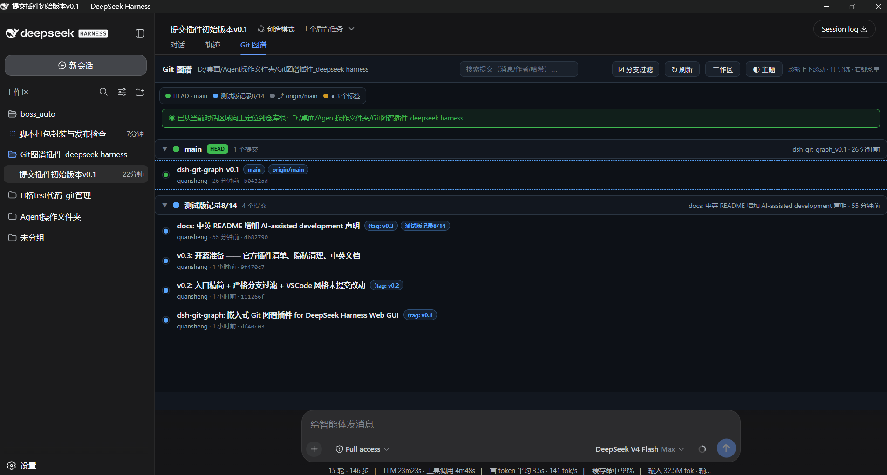

# dsh-git-graph

An embedded git repository graph visualizer for the DeepSeek Harness (DSH) Web GUI.

View, browse and manage git repositories right inside the harness conversation — commit history graph, branch filtering, commit details, file diffs and working-tree changes, all embedded in the interface without leaving the current session.

> 🛠 This plugin is developed with AI assistance.


## 📸 Preview



## ✨ Features

- **Commit history graph**: GitHub-style commit list with foldable per-branch groups and branch coloring
- **Follows the current session**: shows the git repository of the workspace you are viewing; switching sessions follows automatically. Non-git workspaces show an empty state
- **Branch filtering**: checked = visible, unchecked = fully hidden (empty selection shows an empty list)
- **Commit details**: commit message, changed files, per-file diffs, compare two commits (Ctrl+click)
- **Uncommitted changes (VSCode-style)**: grouped file lists (Staged / Changes / Untracked), status badges (A/M/D/R/U), per-file +/− line counts, click-to-expand per-file diff, renames `old → new`, untracked file contents
- **Keyboard shortcuts**: `Ctrl+F` search, `Ctrl+H` back to HEAD, `↑↓` navigation, `Esc` close
- **Dark/light theme**: follows the host GUI automatically, or pin it manually
- **Mount point**: the "Git 图谱" tab inside the session pane (next to the trajectory tab)

## 📦 Installation

### 1. Add the plugin to your profile

Edit your DSH web profile's `package.json` and add the dependency:

```json
{
  "dependencies": {
    "dsh-git-graph": "file:./plugins/git-graph"
  }
}
```

(`plugins/git-graph` is the directory containing this plugin source; adjust the path as needed.)

### 2. Mount the bundle

Add the following to the profile's `cordis.patch.yml`:

```yaml
- insert:
    - id: git-graph
      name: dsh-git-graph
      config:
        repo: "C:/path/to/your/repo"
```

> `config.repo` / `config.repos` is the initial allowlist of repositories the graph panel may open; repositories discovered in the session workspace are added automatically at runtime.

### 3. Install and restart

```bash
pnpm install
# then restart dsh web
```

Open http://127.0.0.1:3080 and select the **Git 图谱** tab in any session.

## 🖱️ Usage

| Action | Description |
| --- | --- |
| "Git 图谱" tab in a session | Open the graph for the current session's workspace |
| Branch group header | Click to fold / unfold that branch |
| ☑ Branch filter | Checked = visible, unchecked = fully hidden |
| Commit row | Click for details; Ctrl+click to compare with another commit |
| Right-click a commit row | Git operation menu |
| "未提交改动" status line / "工作区" button | Open the VSCode-style changes panel; click a file row to expand its diff |
| ↻ Refresh | Reload repository data |

## 🛠️ Development

```
git-graph/
├── index.js          # Server half: git API (graph/branches/workstatus/workfile/diff/...)
├── client.js         # Client half: "Git 图谱" session tab
├── web/index.html    # The graph page (standalone page inside an iframe)
├── package.json      # Plugin manifest (dsh.client.inject + bundle patch)
├── dsh.plugin.json   # Official DSH plugin manifest
└── cordis.patch.yml  # Profile mount point
```

After editing, sync to your DSH deployment directory (`node_modules/dsh-git-graph/`):

```powershell
.\sync-deploy.ps1 -Dst C:\path\to\your\.dsh\profiles\web\node_modules\dsh-git-graph
```

Server (`index.js`) and client (`client.js`) changes require a dsh web restart; `web/index.html` changes take effect after a page refresh. See `AGENTS.md` for full development conventions.

## 📄 License

[MIT](./LICENSE)

## 🙏 Acknowledgements

- [DeepSeek Harness](https://github.com/deepseek-ai/) — the plugin platform
